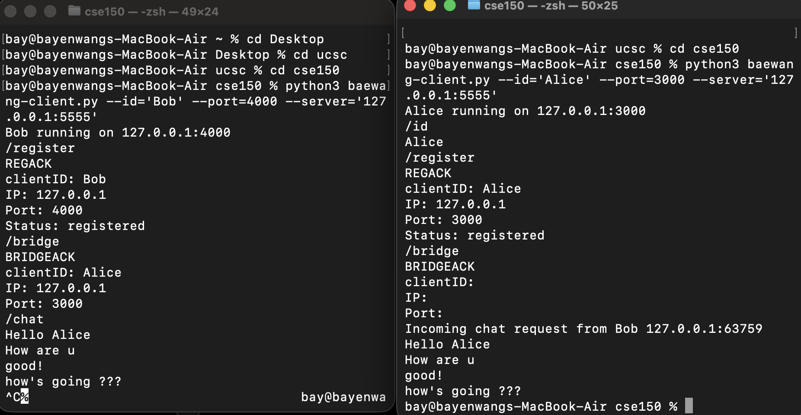
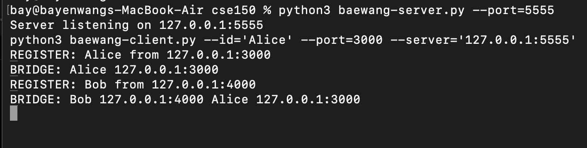
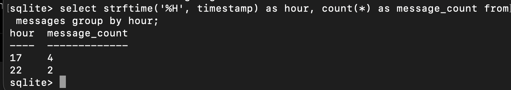

# Real-Time Hybrid Peer-to-Peer Messaging System

## Overview

This project implements a hybrid real-time messaging architecture combining peer-to-peer communication with centralized peer coordination.

The system supports:

- Real-time TCP messaging
- Persistent message storage
- SQLite-based analytics logging
- Concurrent socket I/O handling
- Dynamic client registration
- Basic messaging analytics

---
## Key Networking Concepts

- TCP persistent connections
- Peer-to-peer communication
- Client-server coordination
- Application-layer protocol design
- Concurrent socket I/O using select()
- Reliable message persistence

## Architecture

```text
                REGISTER / BRIDGE
Client A  ─────────────────────────▶  Central Coordination Server
   ▲                                         │
   │                                         │ Peer Discovery
   │                                         ▼
   └──── Persistent Peer-to-Peer TCP ──── Client B
                         │
                         ▼
               SQLite Message Logging
```

## Client State Machine

```text
INIT
  ├── /register
  ├── /bridge
  ▼
WAIT
  ├── listen()
  ├── accept()
  ▼
CHAT
  ├── persistent TCP messaging
  ├── LOG messages
  └── /quit
```
---

## Technologies

- Python
- TCP Socket Programming
- SQLite
- I/O Multiplexing using select()
- Client-Server Networking

---

## Features


- Persistent peer-to-peer TCP communication
- Centralized peer discovery and registration
- Concurrent socket monitoring using select()
- SQLite-based message persistence
- Graceful client shutdown handling
- Analytics-ready message logging

---
## Application Protocol

The system implements a custom text-based application protocol supporting:

```text
REGISTER
BRIDGE
CHAT
LOG
QUIT
```

Each protocol message terminates with CRLF-based headers over TCP streams.

## Future Improvements

- Multi-peer group chat
- WebSocket-based communication
- NAT traversal support
- End-to-end encryption
- Distributed peer discovery

This project was developed to explore distributed systems concepts, peer-to-peer networking, and reliable real-time communication architectures.

## Demo

### Client Chat



### Server Logging



### SQLite Analytics



## Running the System

### Start Server

```bash
python3 server.py --port=5555
```

### Start Client A

```bash
python3 client.py --id='Alice' --port=3000 --server='127.0.0.1:5555'
```

### Start Client B

```bash
python3 client.py --id='Bob' --port=4000 --server='127.0.0.1:5555'
```

After peer discovery through the coordination server, clients establish direct peer-to-peer TCP communication channels for real-time messaging.