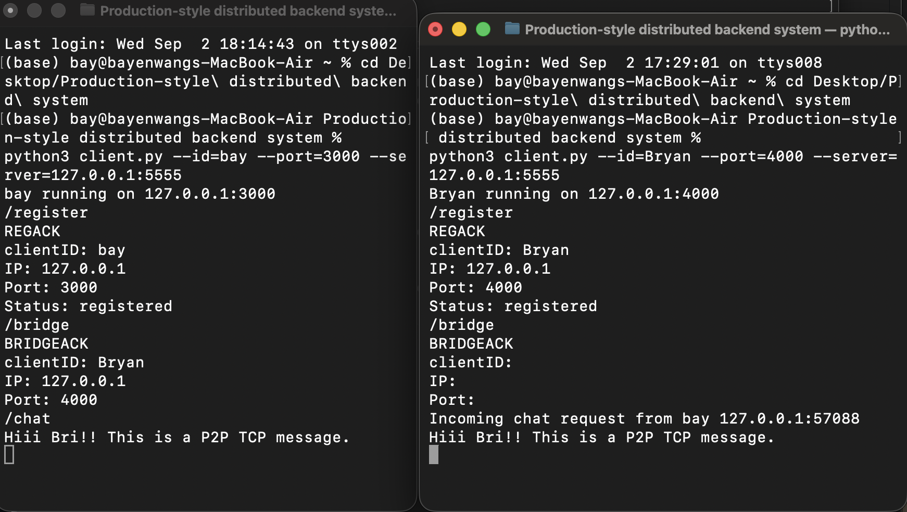
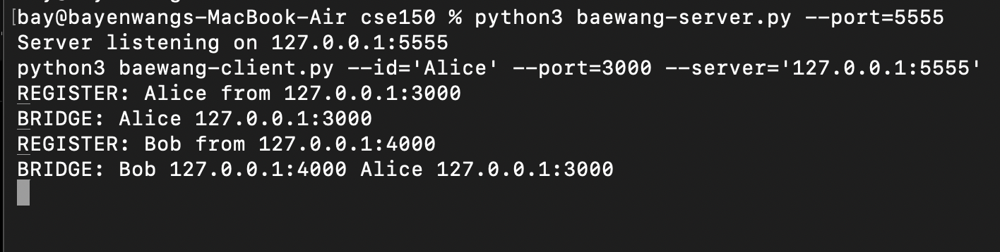
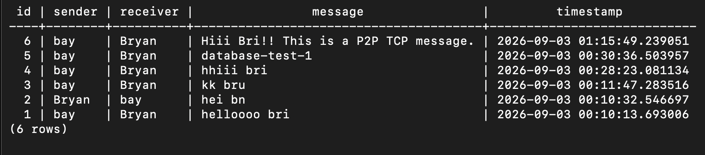
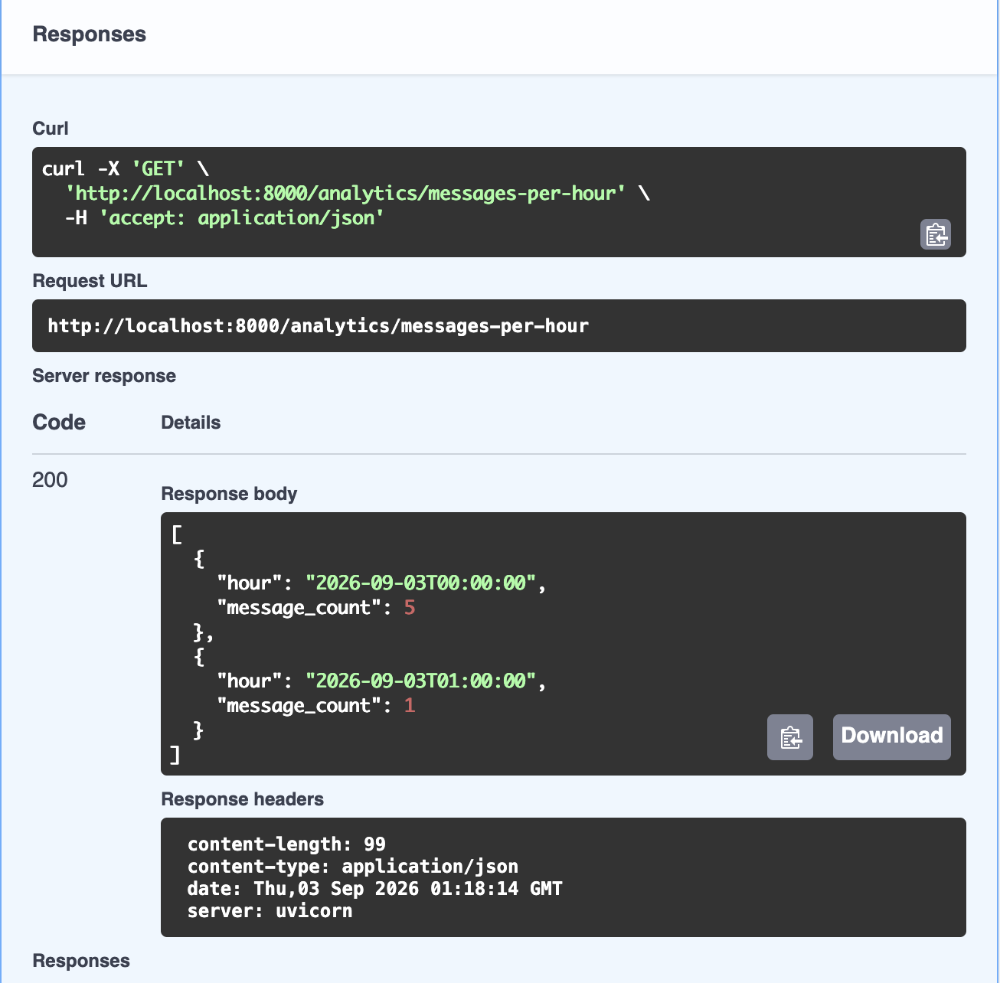

# Real-Time Hybrid Peer-to-Peer Messaging System

## Overview

This project is a production-style distributed backend system built around a hybrid peer-to-peer messaging architecture.

A centralized TCP coordination service handles client registration and peer discovery, while clients establish persistent peer-to-peer TCP connections for real-time messaging. The original messaging system was extended with PostgreSQL for persistent storage, Redis for user presence, FastAPI for management and analytics APIs, structured JSON logging, automated testing with pytest, Docker-based service orchestration, and GitHub Actions CI.

The system demonstrates:

- Real-time peer-to-peer TCP messaging
- Centralized client registration and peer discovery
- PostgreSQL-backed message persistence
- Redis-based user presence management
- REST API access through FastAPI
- Message analytics and aggregation
- Structured JSON event logging
- Automated testing with pytest
- Multi-service orchestration with Docker Compose
- Continuous integration with GitHub Actions

---

## Key Networking Concepts

- Persistent TCP connections
- Peer-to-peer communication
- Client-server coordination
- Application-layer protocol design
- Concurrent socket I/O using `select()`
- Reliable message persistence

---

## Architecture

```text
                         ┌──────────────────────┐
                         │   TCP Coordination   │
                         │        Server        │
                         │      Port 5555       │
                         └──────────┬───────────┘
                                    │
                    REGISTER / BRIDGE / LOG
                                    │
             ┌──────────────────────┴──────────────────────┐
             │                                             │
        ┌────▼─────┐                                 ┌─────▼────┐
        │ Client A │◄──── Persistent P2P TCP ───────►│ Client B │
        └──────────┘                                 └──────────┘
                                    │
                                    │ LOG
                                    ▼
                         ┌──────────────────────┐
                         │     PostgreSQL       │
                         │ Clients / Messages   │
                         └──────────┬───────────┘
                                    │
                         ┌──────────▼───────────┐
                         │       FastAPI        │
                         │ Management /         │
                         │ Analytics API        │
                         └──────────────────────┘

                         ┌──────────────────────┐
                         │        Redis         │
                         │    User Presence     │
                         └──────────────────────┘
```

Backend services are containerized and orchestrated using Docker Compose.

---

## Client State Machine

```text
INIT
  ├── /register
  ├── /bridge
  ▼
WAIT
  ├── listen()
  ├── accept()
  ▼
CHAT
  ├── persistent TCP messaging
  ├── LOG messages
  └── /quit
```

---

## Technologies

### Backend

- Python
- FastAPI
- TCP Socket Programming
- Custom Application-Layer Protocol

### Data

- PostgreSQL
- Redis

### Networking

- Peer-to-Peer TCP Communication
- I/O Multiplexing with `select()`
- Client-Server Coordination

### Testing & Infrastructure

- pytest
- Docker
- Docker Compose
- GitHub Actions

---

## Features

- Persistent peer-to-peer TCP communication
- Centralized peer registration and discovery
- Concurrent socket monitoring using `select()`
- PostgreSQL-backed client and message persistence
- Redis-based user presence tracking
- FastAPI management and analytics endpoints
- Message history retrieval through REST APIs
- Messages-per-hour analytics
- Structured JSON event logging
- Automated API and Redis testing with pytest
- Containerized PostgreSQL, Redis, API, and TCP services
- Automated CI testing with GitHub Actions

---

## Application Protocol

The system implements a custom text-based application protocol supporting:

```text
REGISTER
BRIDGE
CHAT
LOG
QUIT
```

Each protocol message uses CRLF-based headers over TCP streams.

---

## REST API

The FastAPI management service exposes persisted messaging data and analytics through HTTP endpoints.

### Health Check

```http
GET /
```

Returns the status of the management API.

Example response:

```json
{
  "status": "ok",
  "service": "Messaging Management API"
}
```

### Message History

```http
GET /messages
```

Returns persisted message history from PostgreSQL.

Example:

```json
[
  {
    "id": 5,
    "sender": "bay",
    "receiver": "Bryan",
    "message": "database-test-1",
    "timestamp": "2026-09-03T00:30:36.503957"
  }
]
```

### Messages Per Hour

```http
GET /analytics/messages-per-hour
```

Aggregates stored messages by hour.

Example:

```json
[
  {
    "hour": "2026-09-03T00:00:00",
    "message_count": 5
  }
]
```

---

## Testing and Continuous Integration

The project uses pytest for automated backend testing, including:

- API health checks
- Message history retrieval
- Message analytics
- Redis user presence

GitHub Actions automatically runs the test suite on pushes and pull requests.

The CI environment:

1. Starts PostgreSQL and Redis service containers
2. Initializes the PostgreSQL schema
3. Installs Python dependencies
4. Runs the pytest test suite

This ensures backend changes are automatically validated before integration.

---

## Running the System

### Start Backend Services

```bash
docker compose up --build
```

Docker Compose starts:

- TCP coordination server on port `5555`
- FastAPI management service on port `8000`
- PostgreSQL
- Redis

To run the services in the background:

```bash
docker compose up -d
```

### Start Client A

```bash
python3 client.py --id=Alice --port=3000 --server=127.0.0.1:5555
```

Register the client and begin waiting for a peer:

```text
/register
/bridge
```

### Start Client B

```bash
python3 client.py --id=Bob --port=4000 --server=127.0.0.1:5555
```

Register and discover the waiting peer:

```text
/register
/bridge
/chat
```

After peer discovery through the coordination server, the clients establish a direct persistent TCP connection for real-time messaging.

---

## API Examples

Retrieve stored messages:

```bash
curl http://localhost:8000/messages
```

Retrieve messages-per-hour analytics:

```bash
curl http://localhost:8000/analytics/messages-per-hour
```

Run the automated test suite:

```bash
pytest -v
```

---

## Demo

### Client Chat



### Server Logging



### PostgreSQL Message Persistence



### Message Analytics



---

## Future Improvements

- AWS cloud deployment
- WebSocket-based web clients
- Multi-peer group messaging
- NAT traversal for peers across different networks
- End-to-end message encryption
- Authentication and authorization
- Improved Redis presence management with heartbeat-based expiration
- Distributed peer discovery
